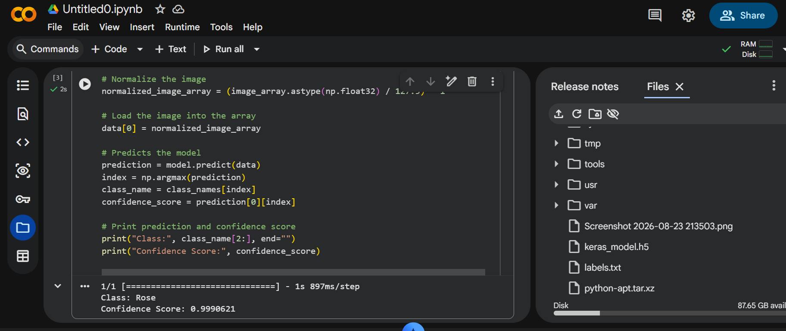

# Image Classification Model — Rose vs Blueberry

## Overview
This project uses **Google Teachable Machine** to train an image recognition
model that classifies images into two classes: **Rose** and **Blueberry**.
The trained model was exported in **TensorFlow → Keras** format and used in a
Python script that loads the model, accepts an input image, and predicts its
class.

## Steps

### 1. Training the model
- The model was trained using [Teachable Machine](https://teachablemachine.withgoogle.com/) (Image Project).
- Two classes were created and trained:
  - **Rose**
  - **Blueberry**
- Multiple sample images were uploaded for each class, and the model was
  trained directly in the browser.

### 2. Exporting the model
- After training, the model was exported using the **TensorFlow** tab →
  **Keras** format.
- This produced two files:
  - `keras_model.h5` — the trained model
  - `labels.txt` — the class names (Rose, Blueberry)

### 3. Writing the prediction script
- A Python script (`predict.py`) was written to:
  1. Load the exported Keras model (`keras_model.h5`)
  2. Load the class labels (`labels.txt`)
  3. Accept an input image, resize/crop it to 224x224
  4. Run the image through the model
  5. Print the predicted class and confidence score

### 4. Running and testing
- The script was tested on a sample image, and the predicted class along
  with the confidence score was printed to the console.

## Files in this repository

| File | Description |
|------|-------------|
| `keras_model.h5` | Trained model exported from Teachable Machine |
| `labels.txt` | Class names (Rose, Blueberry) |
| `predict.py` | Python script that loads the model and predicts image class |
| `OutputScreenshot.png` | Screenshot of the script's output |

## Output

The script successfully loads the trained model, processes the input image,
and predicts its class with a confidence score:

## Tools Used
- Google Teachable Machine (model training)
- Google Colab (running the Python script)
- TensorFlow / Keras (model format and loading)
